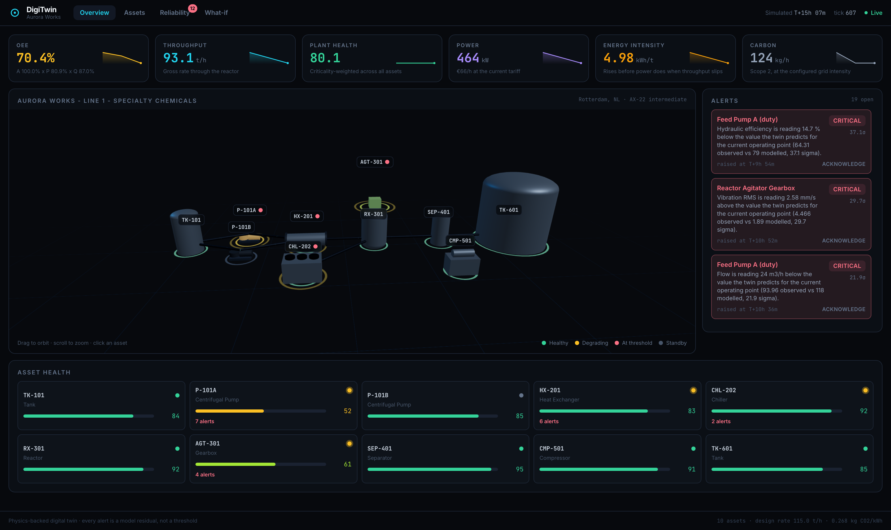
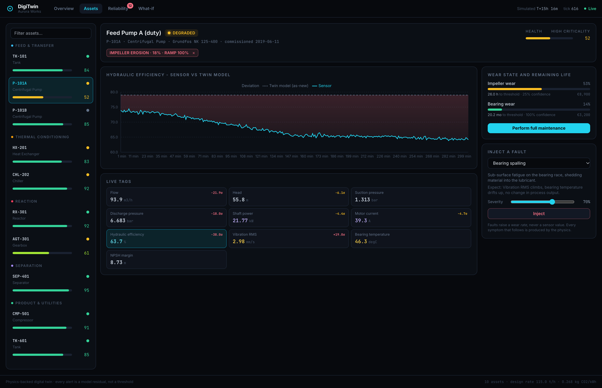
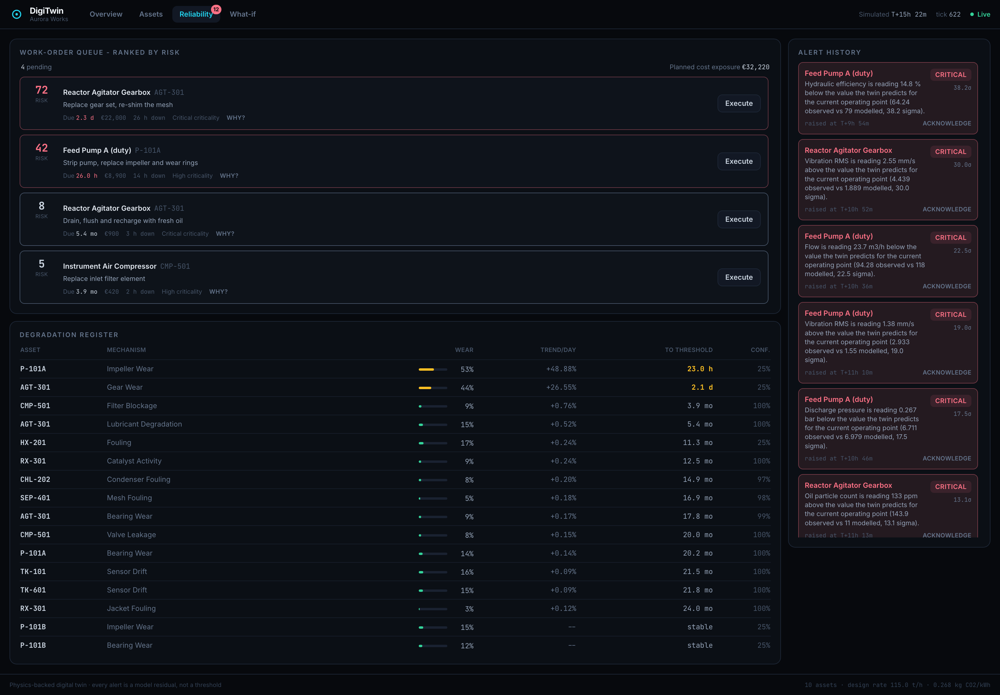
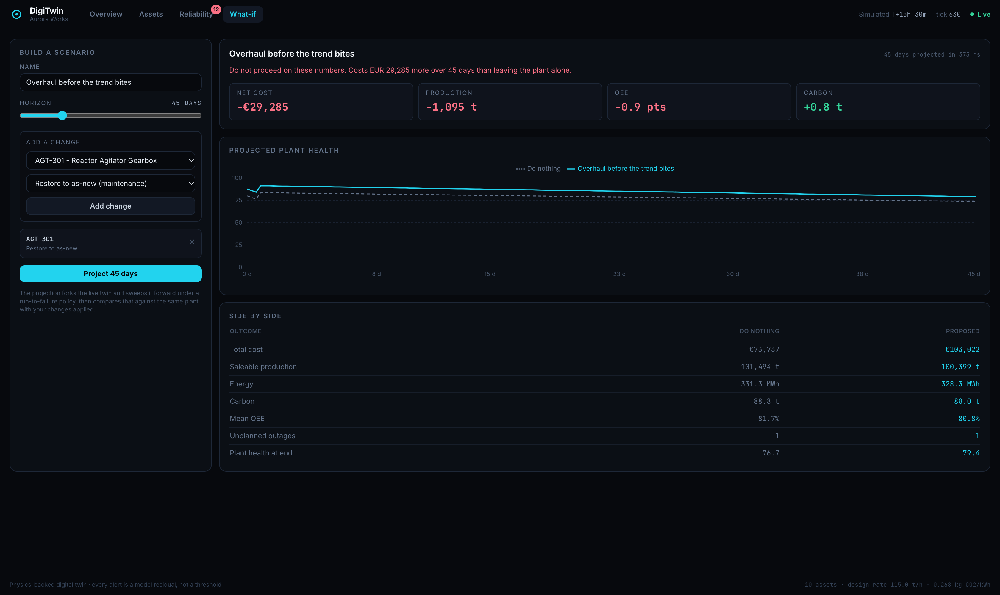

<div align="center">

# DigiTwin

**A physics-backed digital twin for industrial process plants.**

Every alert is a disagreement between a first-principles model and a sensor —
not a threshold someone guessed at.

[Architecture](docs/architecture.md) · [Simulation models](docs/simulation.md) ·
[Analytics](docs/analytics.md) · [API](docs/api.md)

</div>



---

## The problem

Conventional plant monitoring watches sensor values against fixed limits. It
tells you a machine has failed, usually at the moment failure becomes
expensive. A vibration alarm at 4.5 mm/s fires when the bearing is already
finished; a low-flow alarm fires when the pump has already cost you a month of
production.

The alternative is to compare every reading against what a model of that
specific machine says it should be, at the operating point it is actually
running at. When the two stop agreeing, something has changed — and that
happens far earlier than any limit is crossed, and is invisible to a threshold.

Everything here follows from that one idea.

## How it works

`twin-core` solves the entire plant **twice** on every tick.

```
                ┌─────────────────────────────────────────┐
  setpoints ───▶│ REAL       physics(design, wear, fault) │──▶ + noise ──▶ observed
                └─────────────────────────────────────────┘                   │
                ┌─────────────────────────────────────────┐                   │
   measured ───▶│ REFERENCE  physics(design, wear = 0)    │──▶ expected ──────┤
  conditions    └─────────────────────────────────────────┘                   ▼
                                                            residual = observed − expected
                                                                              │
                                    ┌─────────────────────────────────────────┤
                                    ▼              ▼            ▼             ▼
                                  alerts        health        RUL        OEE / cost / CO₂
```

The real pass carries whatever wear has accumulated plus any injected fault,
with measurement noise added — what a historian would have recorded. The
reference pass runs the same asset **as-new**, fed the conditions its real
counterpart actually measured.

The difference is the **residual**, and it is the only thing the analytics
layer reasons about. Which means no symptom anywhere in this codebase is
hard-coded: a worn impeller produces falling flow because `H = H₀ − aQ²` says
it must, not because a branch writes a smaller number.

## What it does

| | |
| --- | --- |
| **Detects change, not failure** | Median/MAD robust baselines with EWMA smoothing and a persistence requirement. Silent across 800 samples of healthy noise; catches a 0.9 mm/s vibration drift that sits well under the ISO 10816 alarm limit. |
| **Localises the fault** | Each reference asset is fed the inputs its real counterpart measured, so the residual is local. Reactor, gearbox and chiller faults alert only on themselves. |
| **Projects remaining life** | Theil–Sen on the wear trend — a median of pairwise slopes, so one bad sample cannot jump the projected date. Recovers a known rate to within 10 %, collapses from 719 days to 4 hours when a fault bites. |
| **Ranks work by risk** | Criticality × urgency × confidence, not by due date. A filter change should not outrank a reactor. |
| **Prices the decision** | Fork the live twin, sweep it forward under run-to-failure, compare against the same plant with the intervention applied. Answer in euros, saleable tonnes and CO₂ in ~330 ms. |
| **Proves itself** | Twelve injectable failure mechanisms. Every one drives a wear *rate*; none writes a sensor value. |

## Quickstart

```bash
git clone https://github.com/anisharajuu/digitwin.git
cd digitwin
make install
make dev
```

Console on **http://localhost:5173**, API docs on **http://localhost:8000/docs**.

Or with Docker — console on `:8080`, API on `:8000`:

```bash
docker compose up --build
```

### Try it in ninety seconds

1. Open the console. The plant is healthy, the feed is quiet.
2. Go to **Assets → P-101A → Inject a fault → Impeller erosion**, severity 70 %.
3. Watch the **Hydraulic efficiency** chart. The sensor line peels away from
   the dashed model line while every value is still comfortably inside its
   normal range.
4. About ninety simulated minutes later the alert fires, naming the deviation
   in sigma. Remaining useful life collapses from months to hours.
5. Go to **What-if**, add "restore P-101A to as-new", project 45 days. The
   verdict tells you what the intervention is worth against doing nothing —
   and it is willing to say no.

Or drive it from the API:

```bash
curl -X POST localhost:8000/api/v1/faults \
  -H 'content-type: application/json' \
  -d '{"asset_id":"P-101A","mode":"impeller_erosion","severity":0.7,"ramp_hours":3}'
```

## The plant

**Aurora Works, Line 1** — a specialty-chemicals line, ten assets, 115 t/h
design rate, about 420 kW.

```
 TK-101 ──▶ P-101A ──▶ HX-201 ──▶ RX-301 ──▶ SEP-401 ──▶ TK-601
  surge      duty       feed      jacketed    product     product
  tank       pump     preheater    reactor    separator     tank
              ▲                       ▲
           P-101B                  AGT-301      CHL-202     CMP-501
           standby                 agitator     chiller     air compressor
```

Each asset is modelled from first principles, not curve-fitted:

| Asset | Model | The tell |
| --- | --- | --- |
| Centrifugal pump | Head curve against a fitted system curve | Wear walks the duty point back; efficiency falls faster than power, so the loss hides on the electricity bill |
| Heat exchanger | Counter-flow effectiveness–NTU | Approach temperature widens before duty visibly drops |
| Jacketed reactor | CSTR, Arrhenius kinetics, PI-controlled jacket, integrated | The control valve saturates long before temperature moves — margin erosion is the early warning |
| Agitator gearbox | ISO 10816 vibration, oil particle count | Nothing touches the process; no production number would ever warn you |
| Chiller | COP and capacity vs condenser fouling | Reliability becomes a production problem the moment capacity runs out |
| Screw compressor | Empirical performance map | Honest about being empirical: oil injection makes an adiabatic discharge temperature badly wrong |
| Separator | Split efficiency, the plant's quality term | On-spec yield is conversion × split, end to end |
| Buffer vessels | Integrated mass balance vs transmitter reading | A drift fault separates the two without moving a drop of liquid |

The plant is pure configuration — [`aurora_works.yaml`](services/twin-core/app/plant/aurora_works.yaml)
holds identity, topology, 3D placement and nameplate data. Physics binds by
asset `kind`.

## The console

Four views, built on one WebSocket so nothing on screen can be a tick out of
step with anything else.

| | |
| --- | --- |
| **Overview** | KPIs, a live 3D plant at true scale, and the alert feed. Equipment renders as neutral steel and only degrading assets take colour — when everything is green, green stops carrying information. |
| **Assets** | Sensor against model on one pair of axes, with the residual shaded between them. Live tags badged with their deviation in sigma, wear state, remaining life, and fault injection. |
| **Reliability** | The risk-ranked work-order queue, a degradation register across the whole line, and alert history. |
| **What-if** | Build an intervention, project it, get the answer in money. |



Work ranked by risk, and every wear mechanism on the line with its trend and
time to threshold:



And the question that releases budget, answered in money:



Screenshots are generated, not staged — [`scripts/screenshots.py`](scripts/screenshots.py)
drives a headless Chrome over the DevTools protocol, waits for the twin to
connect and for the plant view to actually draw a frame, then captures. Run it
with `make screenshots` against a running stack.

## Testing

78 tests covering the physics, the analytics and the API.

```bash
make test     # pytest
make lint     # ruff + tsc
make check    # both
```

The suite asserts the claims this README makes, not just that the code runs:
an as-new pump lands on its BEP; bearing wear moves vibration and leaves flow
untouched; the reactor holds setpoint with control headroom both ways; the
detector is silent on 800 samples of noise and on a settled plant; a single
spike raises nothing; Theil–Sen recovers a known wear rate; a projection does
not perturb the live twin; and — a regression test for a bug that took real
debugging — **a fault alerts on the asset that has it**.

## Layout

```
services/twin-core/        FastAPI · simulation · analytics
  app/plant/               the plant, as configuration
  app/simulation/          physics, degradation, faults, engine, scenarios
  app/analytics/           residual detection, RUL, KPIs
  app/api/                 REST + WebSocket
  tests/                   78 tests
apps/console/              React · TypeScript · three.js · Recharts
docs/                      architecture, models, analytics, API
scripts/screenshots.py     reproducible doc screenshots over CDP
infra: Makefile · docker-compose.yml · GitHub Actions
```

## Honest limitations

A twin that oversells itself is worse than no twin at all.

- **Residuals are not perfectly stationary.** Some scale with load, so a large
  swing in operating point can move a z-score without any change in asset
  health. Secondary alerts on neighbouring equipment during a big upset are
  real but are symptoms, not causes. Ranking puts the true cause at the top of
  the feed; explicit causal grouping is not implemented.
- **Faults are single-mechanism.** Real failures interact; these mostly do not.
- **No persistence.** History lives in memory and restarts with the process.
  [`store/timeseries.py`](services/twin-core/app/store/timeseries.py) is the
  only module that knows where points live — swapping in TimescaleDB means
  reimplementing one class.
- **One plant.** Multi-site, auth and tenancy are not in scope here.

## Licence

MIT — see [LICENSE](LICENSE).
